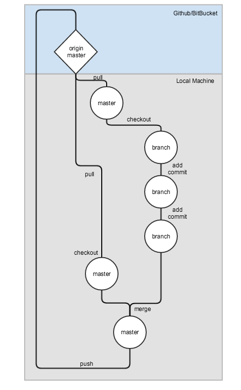

Git 4 Groups
============

Example project for using git with a group.



My usual workflow:
-----------------
* pull master from origin before doing any work
* check that it works
* break off a feature branch for the feature/set of features I'll be working on
* add/commit as usual on that branch
* check out master
* pull from origin (in case anyone else has made any changes recently)
* check that master works
* merge in my branch (git merge BRANCHNAME)
* check that master works
* push to origin

ex:
---
* ```git pull origin master```
* check that it works
* ```git checkout -b 'loginInterface'```
* do my work and ``` git add .``` ```git commit -m 'login interface updated'``` (possibly many times)
* ```git checkout master``` (making sure everything is committed on my feature branch first)
* `` git pull origin master```
* check that it works
* ```git merge loginInterface```
* check that it works
* ```git push origin master```
